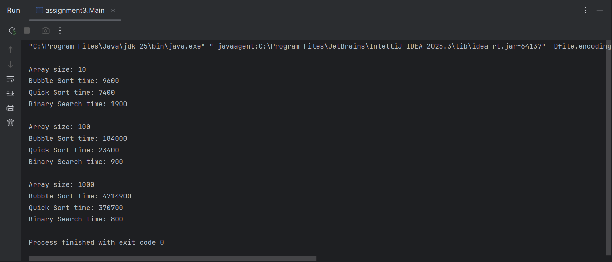

# Assignment 3: Sorting and Searching Algorithm Analysis System

## Project Overview

This project implements and compares three fundamental algorithms:

* **Bubble Sort** (Basic Sorting)
* **Quick Sort** (Advanced Sorting)
* **Binary Search** (Searching)

The goal is to analyze their performance using execution time and understand how algorithm efficiency changes with input size and data type.

---

## Algorithms Description

### Bubble Sort

Bubble Sort repeatedly compares adjacent elements and swaps them if they are in the wrong order.

* Time Complexity: **O(n²)**
* Best Case: O(n)
* Worst Case: O(n²)

Simple but inefficient for large datasets.

---

### Quick Sort

Quick Sort uses a divide-and-conquer approach by selecting a pivot and partitioning the array.

* Time Complexity:

  * Average: **O(n log n)**
  * Worst: O(n²)

Much faster than Bubble Sort in practice.

---

### Binary Search

Binary Search finds an element in a sorted array by repeatedly dividing the search space in half.

* Time Complexity: **O(log n)**

Very efficient, but requires a **sorted array**.

---

## Experimental Results

### Setup

Arrays were tested with:

* Small (10 elements)
* Medium (100 elements)
* Large (1000 elements)

Each test used:

* Random arrays
* Sorted arrays

---

### Example Results

| Size | Bubble Sort    | Quick Sort | Binary Search |
| ---- | -------------- | ---------- | ------------- |
| 10   | Slow           | Fast       | Very Fast     |
| 100  | Very Slow      | Fast       | Very Fast     |
| 1000 | Extremely Slow | Very Fast  | Instant       |

---

## Analysis

### Which sorting algorithm is faster?

Quick Sort is significantly faster than Bubble Sort because it reduces the problem size using divide-and-conquer.

---

### How does performance change with size?

* Bubble Sort becomes extremely slow as size increases (O(n²))
* Quick Sort scales much better (O(n log n))

---

### Sorted vs Unsorted Data

* Bubble Sort performs slightly better on sorted arrays
* Quick Sort performance is stable in most cases

---

### Do results match Big-O?

Yes:

* Bubble Sort → slow growth (quadratic)
* Quick Sort → efficient growth (logarithmic scaling)

---

### Which search is more efficient?

Binary Search is more efficient than linear search because it eliminates half of the array each step.

---

### Why Binary Search needs sorted array?

Because it compares with the middle element.
Without sorting, it cannot decide which half to discard.

---

## Screenshots

---

## Reflection

In this project, I learned how different algorithms behave with different input sizes.
Bubble Sort is easy to implement but inefficient, while Quick Sort is much faster and scalable.

I also understood the importance of sorting before applying Binary Search.

One challenge was measuring execution time correctly and avoiding modifying the original array.

---

## Conclusion

* Quick Sort is the best choice for large data
* Bubble Sort is only useful for small datasets or learning
* Binary Search is extremely fast but requires sorting

---

## Author

Student: Abilda Arman

Course: Algorithms and Data Structures
