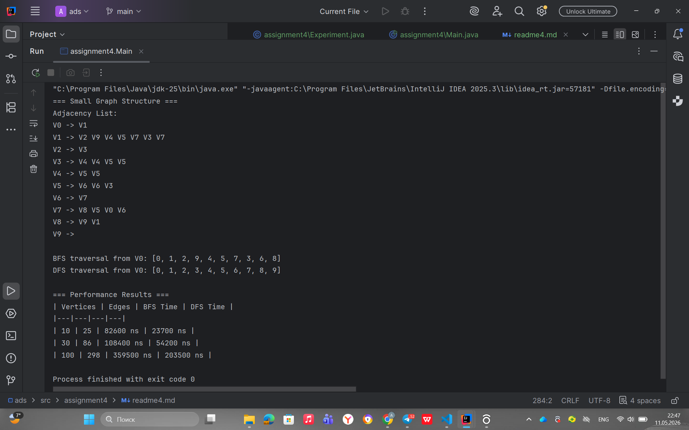

# Assignment 4

## Project Overview

This project implements a graph traversal system in Java. The graph is represented using an **adjacency list**, where each vertex stores a list of its connected neighboring vertices.

A graph consists of:

- **Vertices**: nodes of the graph, for example `V0`, `V1`, `V2`.
- **Edges**: connections between vertices, for example `V0 -> V1`.
- **Adjacency list**: a memory-efficient graph representation where every vertex has a list of outgoing edges.

The project includes two main traversal algorithms:

- **Breadth-First Search (BFS)**
- **Depth-First Search (DFS)**

The program creates three graphs with different sizes: **10 vertices**, **30 vertices**, and **100 vertices**. It runs BFS and DFS on each graph and measures execution time using `System.nanoTime()`.

---

## How to Run

Open terminal in the project folder and run:

- `javac src/*.java`
- `java -cp src Main`

---

## Class Descriptions

### Vertex.java

The `Vertex` class represents one node in the graph.

Main elements:

- private field `id`
- constructor
- getter method `getId()`
- `toString()` method for readable output

Example:

```java
Vertex v = new Vertex(1);
```

---

### Edge.java

The `Edge` class represents a connection between two vertices.

Main elements:

- private field `source`
- private field `destination`
- constructor
- getter methods
- `toString()` method

Example:

```java
V1 -> V2
```

---

### Graph.java

The `Graph` class stores vertices and edges using an adjacency list.

Main methods:

- `addVertex(Vertex v)`
- `addEdge(int from, int to)`
- `printGraph()`
- `bfs(int start)`
- `dfs(int start)`
- `bfsOrder(int start)`
- `dfsOrder(int start)`

The adjacency list is stored using:

`
Map<Integer, List<Integer>> adjacencyList;
`

This means each vertex ID is connected to a list of neighbor vertex IDs.

---

### Experiment.java

The `Experiment` class runs tests and measures performance.

Main methods:

- `runTraversals(Graph g)`
- `runMultipleTests()`
- `printResults()`

It creates graphs with:

- 10 vertices
- 30 vertices
- 100 vertices

Then it measures BFS and DFS execution time using:

- `long start = System.nanoTime();`

- `long end = System.nanoTime();`

---

## Algorithm Descriptions

## Breadth-First Search (BFS)

### Step-by-step explanation

1. Start from the selected vertex.
2. Mark the starting vertex as visited.
3. Put it into a queue.
4. Remove the first vertex from the queue.
5. Visit all unvisited neighbors of this vertex.
6. Add those neighbors to the queue.
7. Repeat until the queue becomes empty.

### Main idea

BFS visits vertices **level by level**. It checks all close neighbors first before moving deeper into the graph.

### Use cases

BFS is useful when we need:

- the shortest path in an unweighted graph
- level-by-level search
- social network connection distance
- finding the nearest target

### Time complexity

```text
O(V + E)
```

Where:

- `V` = number of vertices
- `E` = number of edges

BFS visits every vertex and every edge at most once.

---

## Depth-First Search (DFS)

### Step-by-step explanation

1. Start from the selected vertex.
2. Mark the vertex as visited.
3. Move to the first unvisited neighbor.
4. Continue going deeper until there are no unvisited neighbors.
5. Go back and check other branches.
6. Repeat until all reachable vertices are visited.

### Main idea

DFS goes **as deep as possible** before returning back to explore other paths.

### Use cases

DFS is useful for:

- checking if a path exists
- cycle detection
- topological sorting
- solving mazes
- exploring connected components

### Time complexity

```text
O(V + E)
```

DFS also visits every vertex and every edge at most once.

---

## Experimental Results

The program was tested on three graph sizes: 10, 30, and 100 vertices.

| Vertices | Edges |  BFS Time |  DFS Time |
|---:|---:|----------:|----------:|
| 10 | 25 |  82600 ns |  23700 ns |
| 30 | 86 | 108400 ns |  54200 ns |
| 100 | 298 | 359500 ns | 203500 ns |

> Note: Execution time can be different on another computer because it depends on hardware, JVM state, and system load.

---

## Observations and Analysis

### How does graph size affect BFS and DFS performance?

When the graph size increases, traversal time usually increases because the algorithms need to visit more vertices and edges. A graph with 100 vertices requires more operations than a graph with 10 vertices.

### Which traversal is faster in your experiments?

In this sample run, DFS was faster on the large graph, while BFS was faster on the small and medium graphs. The difference is small because both algorithms have the same theoretical complexity. Actual results can change depending on graph structure and computer performance.

### Do results match the expected complexity O(V + E)?

Yes. The results match the expected complexity `O(V + E)` because both algorithms process vertices and edges. As the number of vertices and edges increases, the execution time also generally increases.

### How does graph structure affect traversal order?

Graph structure strongly affects traversal order. BFS visits nearby vertices first, while DFS follows one path deeply before returning to other branches. If the order of neighbors in the adjacency list changes, the traversal order can also change.

### When is BFS preferred over DFS?

BFS is preferred when we need the shortest path in an unweighted graph or when we need to explore the graph level by level.

### What are the limitations of DFS?

DFS can go very deep into one branch and may not find the shortest path. Also, recursive DFS can cause stack overflow if the graph is extremely large or very deep.

---

## Screenshots

### Output



---

## Reflection

During this assignment, I learned how graphs can be represented using an adjacency list and how traversal algorithms work in practice. I also understood that vertices represent objects or points, while edges represent relationships or connections between them.

BFS and DFS are both useful graph traversal algorithms, but they behave differently. BFS explores a graph level by level and is useful for shortest path problems in unweighted graphs. DFS explores deeply before backtracking and is useful for path checking, cycle detection, and exploring connected components. The main challenge was organizing the code into separate classes and making the experiment results clear and readable.

---

## Conclusion

This project demonstrates graph representation using an adjacency list and compares BFS and DFS traversal algorithms. The experiment confirms that both algorithms have time complexity `O(V + E)` and that graph size and graph structure affect performance and traversal order.
